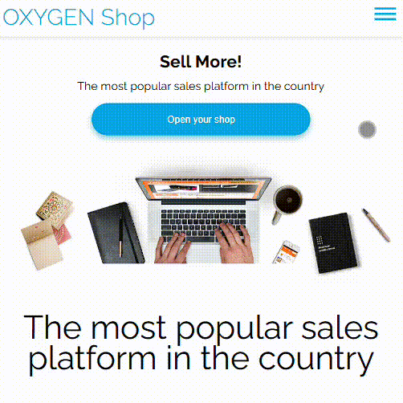

Oxigen Shop - Proyecto Training

Este proyecto consiste en el diseño y desarrollo de una página web de ventas moderna y responsiva, utilizando HTML, Sass y CSS.

## Previsualización
* GitHub.io: [Echa un vistazo](https://alfonsogismera.github.io/Oxigen_Shop/)
### Ordenador

<!-- <p align="center">
  
</p>

### Móvil
<p align="center">
  
</p> -->

## Instrucciones de Instalación y Uso

1. Clona el repositorio: `git clone https://github.com/theodelrieu?tab=repositories`
2. Abre el archivo `index.html` en tu navegador.
3. Para compilar los archivos Sass, ejecuta el siguiente comando en la terminal: `sass --watch scss:css`

## Características Destacadas

* Diseño responsivo que se adapta a diferentes dispositivos.
* Estructura clara y fácil de navegar.
* Estilos personalizados con Sass para una mayor flexibilidad.

## Extras - Manejo de Finales de Línea ⚠️

Estoy usando Windows, que utiliza finales de línea CRLF. El archivo `css/styles.css` tiene finales de línea LF, típicos de sistemas Unix. Git te avisará para reemplazar los LF por CRLF para mantener la consistencia en tu sistema y viceversa.

**Importancia:** La consistencia en los finales de línea es importante para evitar problemas de ejecución y facilitar la comparación y fusión de código.

**Solución:** Se recomienda configurar Git para manejar los finales de línea correctamente. Puedes usar un archivo `.gitattributes` en la raíz de tu repositorio con el siguiente contenido:

```
* text=auto
*.css text eol=lf
```

Para aplicar esta configuración, ejecuta:
```bash
git config --global core.autocrlf input
```

Este archivo te permite especificar cómo Git debe manejar los finales de línea para archivos o tipos de archivos específicos, dándote más control y evitando cambios inesperados.

## Posibles Mejoras

* **Implementación de JavaScript⚡:** Añadir interactividad con animaciones, validaciones de formularios y efectos dinámicos.
* **Integración con una Base de Datos:** Gestionar productos, usuarios y pedidos de forma eficiente.
* **Optimización SEO:** Mejorar el posicionamiento en buscadores con metaetiquetas, contenido relevante y estructura semántica.
* **Añadir Test Unitarios✅:** Para asegurar la calidad del código.
* **Despliegue Continuo ☁️:** Para poder actualizar la página de una forma más automática.

## Información de Contacto

* GitHub: [Echa un vistazo](https://github.com/AlfonsoGismera)

## ✍️ Autor

Alfonso Gismera

## Licencia

Este proyecto no tiene licencia, se ha usado para reforzar conocimientos.

