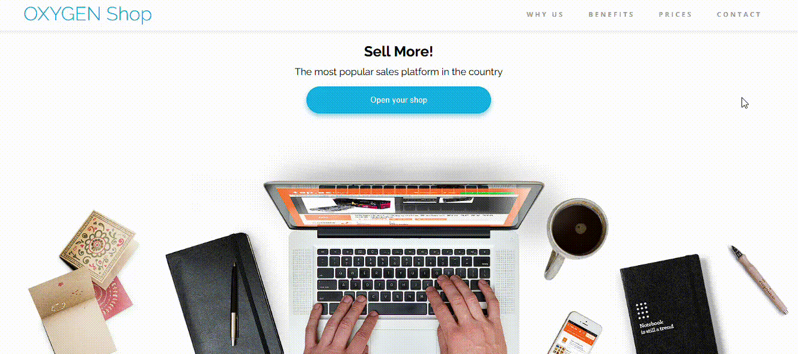

Oxigen Shop - Proyecto Training
===============================

**Oxigen Shop** es una tienda online de demostración desarrollada como parte de un proyecto de entrenamiento. Su objetivo es mostrar un diseño moderno, accesible y totalmente responsive, implementado con **HTML5**, **Sass** (SCSS) y **CSS3**.

🔗 **Previsualización**
- GitHub Pages: https://alfonsogismera.github.io/Oxigen_Shop/

Visualiza cómo se adapta la interfaz en distintos dispositivos:

  

  

---

## 🚀 Tecnologías utilizadas

- **HTML5**
- **Sass (SCSS)**
- **CSS3**
- **BEM (Block, Element, Modifier)**

---

## 🏗️ Estructura del proyecto

\`\`\`bash
Oxigen_Shop/
├── img/                  # Recursos gráficos (GIFs, iconos...)
├── scss/                 # Archivos fuente de Sass
│   ├── base/             # Variables, mixins y resets
│   ├── components/       # Componentes reutilizables
│   ├── layout/           # Grid y diseño global
│   ├── pages/            # Estilos específicos de páginas
│   └── main.scss         # Archivo principal de importación
├── css/                  # CSS compilado (output)
│   └── styles.css
└── index.html            # Página principal
\`\`\`

---

## ⚙️ Instalación y ejecución

1. Clona el repositorio:
   \`\`\`bash
   git clone https://github.com/AlfonsoGismera/Oxigen_Shop.git
   \`\`\`
2. Accede a la carpeta del proyecto:
   \`\`\`bash
   cd Oxigen_Shop
   \`\`\`
3. Abre \`index.html\` en tu navegador o instala un servidor local:
   \`\`\`bash
   live-server
   \`\`\`
4. Para compilar y ver los cambios de Sass en tiempo real:
   \`\`\`bash
   sass --watch scss:css
   \`\`\`

---

## ✨ Características principales

- Diseño **responsive** adaptado a móviles, tablets y escritorio.
- Código modular y semántico.
- Uso de **variables** y **mixins** en Sass.
- Compatibilidad con navegadores modernos.

---

## 📐 Metodología BEM

Para mantener un CSS escalable y fácil de mantener, se ha aplicado la convención **BEM**:

1. **Block** (Bloque): componente independiente con significado por sí mismo.
   \`\`\`scss
   .card { /* bloque */ }
   \`\`\`
2. **Element** (Elemento): parte constituyente de un bloque, separado por \`__\`.
   \`\`\`scss
   .card__title { /* elemento de card */ }
   \`\`\`
3. **Modifier** (Modificador): variación de bloque o elemento, separado por \`--\`.
   \`\`\`scss
   .card--highlight { /* bloque alternativo */ }
   .card__title--small { /* elemento en variante */ }
   \`\`\`

**Ventajas de BEM:**
- Claridad en la relación entre HTML y CSS.
- Evita colisiones globales de nombres.
- Facilita la lectura y mantenimiento del código.

---

## ⚠️ Manejo de finales de línea (EOL)

Este proyecto utiliza finales de línea **LF** para compatibilidad Unix/macOS. Si trabajas en Windows (**CRLF**), Git puede alertarte de diferencias. Para unificar:

1. Añade un archivo \`.gitattributes\` en la raíz:
   \`\`\`gitattributes
   * text=auto
   *.css text eol=lf
   \`\`\`
2. Configura Git:
   \`\`\`bash
   git config --global core.autocrlf input
   \`\`\`

Así, evitarás cambios de EOL no deseados y conflictos al fusionar.

---

## 🤝 Contribuciones

¡Se aceptan pull requests! Para contribuir:
1. Haz un fork del repositorio.
2. Crea una rama (\`git checkout -b feature/nueva-caracteristica\`).
3. Realiza tus cambios y haz commit (\`git commit -m 'Añadir nueva característica'\`).
4. Envía tu branch a tu fork y crea un Pull Request.

---

## 📬 Contacto

- GitHub: [AlfonsoGismera](https://github.com/AlfonsoGismera)

---

## 🖋️ Autor

**Alfonso Francisco Gismera Perea**

---

## 📄 Licencia

Este proyecto es de carácter educativo y no cuenta con una licencia específica.
